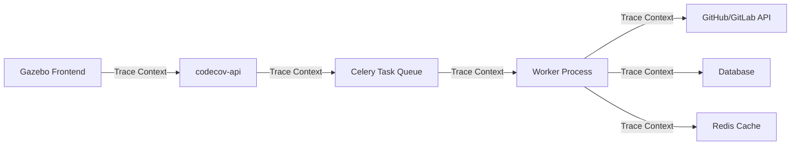

# Sentry Integration Comprehensive Guide

This document provides a complete guide to Sentry integration across Codecov's services, combining performance monitoring with business-critical experience tracking.

## Table of Contents

1. [Overview](#overview)
2. [Integration Strategy](#integration-strategy)
3. [Architecture](#architecture)
4. [Implementation Guide](#implementation-guide)
   - [Performance Monitoring Layer](#performance-monitoring-layer)
   - [Critical Experiences Layer](#critical-experiences-layer)
   - [Unified Approach](#unified-approach)
5. [Service Integrations](#service-integrations)
   - [Backend Services](#backend-services)
   - [Frontend (Gazebo)](#frontend-gazebo)
   - [CLI Tools](#cli-tools)
6. [Dashboards and Visualizations](#dashboards-and-visualizations)
   - [Technical Dashboards](#technical-dashboards)
   - [Business Dashboards](#business-dashboards)
   - [Upload Performance Dashboard](#upload-performance-dashboard)
7. [Alerting and Monitoring](#alerting-and-monitoring)
8. [Configuration Reference](#configuration-reference)
9. [Development Setup](#development-setup)
10. [Best Practices](#best-practices)
11. [Implementation Timeline](#implementation-timeline)

## Overview

Codecov uses Sentry for comprehensive monitoring that combines:

### Technical Excellence
- **Error Tracking**: Capturing and monitoring application errors across all services
- **Performance Monitoring**: Tracking application performance and identifying bottlenecks
- **Distributed Tracing**: Following requests across multiple services
- **Infrastructure Health**: Monitoring system resources and dependencies

### Business Intelligence
- **Critical Experiences**: Monitoring business-critical user journeys with revenue impact
- **Customer Context**: Adding business value to technical metrics
- **Proactive Support**: Enabling customer success interventions before churn
- **ROI Tracking**: Connecting technical performance to business outcomes

## Integration Strategy

Codecov employs a **dual-layer monitoring approach**:

```
┌─────────────────────────────────────────────────────────────┐
│                    Critical Experiences Layer                │
│  (Business Context, Revenue Impact, Customer Success Alerts) │
├─────────────────────────────────────────────────────────────┤
│                 Performance Monitoring Layer                 │
│    (Traces, Spans, Metrics, SLOs, Technical Dashboards)    │
├─────────────────────────────────────────────────────────────┤
│                    Infrastructure Layer                      │
│        (Distributed Tracing, Error Tracking, Logs)         │
└─────────────────────────────────────────────────────────────┘
```

### Foundation Layer: Comprehensive Performance Monitoring
- Track all operations across services
- Maintain technical SLOs
- Provide debugging context
- Monitor infrastructure health

### Focus Layer: Critical Experiences
- Identify business-critical user journeys
- Add revenue and customer context
- Enable proactive customer success
- Prioritize fixes by business impact

## Architecture

### Current State Limitations
1. **Limited Performance Tracking** - Basic error tracking without comprehensive metrics
2. **No Distributed Tracing** - Missing trace propagation between services
3. **Insufficient Granularity** - Monolithic operation tracking
4. **No Business Context** - Technical metrics disconnected from business impact

### Target Architecture

#### Enhanced Upload Performance Tracking
```python
# Key metrics to track:
- upload.total_duration
- upload.stage.{stage_name}.duration
- upload.file_size
- upload.coverage_lines
- upload.notification.latency
- upload.queue_time
```

#### Distributed Tracing Flow


## Implementation Guide

### Performance Monitoring Layer

```python
# apps/worker/helpers/performance_monitoring.py

from contextvars import ContextVar
from typing import Optional
import sentry_sdk
from sentry_sdk import set_measurement, set_tag

class PerformanceMonitor:
    """
    Base performance monitoring for all operations.
    Provides technical metrics and traces.
    """
    
    @staticmethod
    def track_operation(
        operation_name: str,
        operation_type: str = "task",
        capture_performance: bool = True
    ):
        """Decorator for basic performance tracking"""
        def decorator(func):
            @wraps(func)
            def wrapper(*args, **kwargs):
                with sentry_sdk.start_transaction(
                    op=f"{operation_type}.{operation_name}",
                    name=operation_name,
                    sampled=capture_performance
                ) as transaction:
                    # Set basic technical context
                    set_tag("operation.type", operation_type)
                    set_tag("operation.name", operation_name)
                    
                    # Track technical metrics
                    start_time = time.time()
                    start_memory = get_memory_usage()
                    
                    try:
                        result = func(*args, **kwargs)
                        set_tag("operation.status", "success")
                        return result
                    except Exception as e:
                        set_tag("operation.status", "error")
                        set_tag("error.type", type(e).__name__)
                        raise
                    finally:
                        # Record technical measurements
                        duration = time.time() - start_time
                        memory_delta = get_memory_usage() - start_memory
                        
                        set_measurement("operation.duration", duration, "second")
                        set_measurement("operation.memory_delta", memory_delta, "byte")
            
            return wrapper
        return decorator
```

### Critical Experiences Layer

```python
# apps/worker/helpers/critical_experiences.py

from enum import Enum
from typing import Dict, Any
import sentry_sdk
from sentry_sdk import set_tag, set_context, set_measurement

class CriticalExperience(Enum):
    UPLOAD_PROCESSING = "upload_processing"
    PR_COMMENT = "pr_comment_generation"
    FIRST_UPLOAD = "first_time_upload"
    DASHBOARD_LOAD = "enterprise_dashboard"
    COVERAGE_REPORT = "coverage_report_generation"

class CriticalExperienceTracker:
    """
    Track critical user experiences with business context
    """
    
    def __init__(self, experience: CriticalExperience, organization: Owner):
        self.experience = experience
        self.organization = organization
        self.transaction = None
        
    def __enter__(self):
        # Start transaction with business context
        self.transaction = sentry_sdk.start_transaction(
            op=f"critical_experience.{self.experience.value}",
            name=f"Critical Experience: {self.experience.value}",
            sampled=True  # Always sample critical experiences
        )
        self.transaction.__enter__()
        
        # Add business context
        self._add_business_context()
        
        return self
    
    def _add_business_context(self):
        """Add business-relevant context to the transaction"""
        # Organization context
        set_context("organization", {
            "id": self.organization.ownerid,
            "name": self.organization.username,
            "plan": self.organization.plan,
            "value_tier": self._calculate_value_tier(),
            "is_trial": self.organization.trial_status == "ongoing",
            "activated_users": len(self.organization.activated_users or []),
            "repo_count": self.organization.repos.count(),
        })
        
        # Business impact tags
        set_tag("experience.type", self.experience.value)
        set_tag("customer.tier", self._get_customer_tier())
        set_tag("revenue.impact", self._calculate_revenue_impact())
        set_tag("churn.risk", self._calculate_churn_risk())
```

### Unified Approach

```python
# Example: Upload processing with both layers

@PerformanceMonitor.track_operation("upload_task", capture_performance=True)
@CriticalExperienceMonitor.track_critical_experience(
    "upload_processing",
    organization=lambda self, *args, **kwargs: self.get_organization(kwargs),
    add_business_context=lambda self, *args, **kwargs: self.is_critical_org(kwargs)
)
def process_upload(self, upload_id: str, **kwargs):
    """
    Process upload with both technical performance monitoring
    and business impact tracking for critical organizations.
    """
    upload = self.get_upload(upload_id)
    
    # Technical performance tracking
    with PerformanceMonitor.track_span("parse_coverage"):
        coverage_data = self.parse_coverage(upload)
    
    # Critical experience checkpoints for important customers
    if self.is_critical_org(upload.repository.author):
        with CriticalExperienceMonitor.checkpoint("coverage_processing", {
            "file_count": len(coverage_data.files),
            "line_count": coverage_data.total_lines,
        }):
            report = self.process_coverage(coverage_data)
    else:
        with PerformanceMonitor.track_span("process_coverage"):
            report = self.process_coverage(coverage_data)
    
    return report
```

## Service Integrations

### Backend Services

#### codecov-api

**Location**: `apps/codecov-api/codecov/settings_base.py`

```python
SENTRY_ENV = os.environ.get("CODECOV_ENV", None)
SENTRY_DSN = os.environ.get("SERVICES__SENTRY__SERVER_DSN", None)
SENTRY_DENY_LIST = DEFAULT_DENYLIST + ["_headers", "token_to_use"]

if SENTRY_DSN is not None:
    SENTRY_SAMPLE_RATE = float(os.environ.get("SERVICES__SENTRY__SAMPLE_RATE", "0.1"))
    sentry_sdk.init(
        dsn=SENTRY_DSN,
        event_scrubber=EventScrubber(denylist=SENTRY_DENY_LIST),
        _experiments={
            "enable_logs": True,
        },
        integrations=[
            DjangoIntegration(signals_spans=False),
            CeleryIntegration(),
            RedisIntegration(cache_prefixes=["cache:"]),
            HttpxIntegration(),
        ],
        environment=SENTRY_ENV,
        traces_sample_rate=SENTRY_SAMPLE_RATE,
        profiles_sample_rate=float(
            os.environ.get("SERVICES__SENTRY__PROFILE_SAMPLE_RATE", "0.01")
        ),
    )
```

#### worker

**Location**: `apps/worker/helpers/sentry.py`

```python
def initialize_sentry() -> None:
    version = get_current_version()
    version_str = f"worker-{version}"
    sentry_dsn = get_config("services", "sentry", "server_dsn")
    sentry_sdk.init(
        sentry_dsn,
        sample_rate=float(os.getenv("SENTRY_PERCENTAGE", "1.0")),
        environment=os.getenv("DD_ENV", "production"),
        traces_sample_rate=float(os.environ.get("SERVICES__SENTRY__SAMPLE_RATE", "1")),
        profiles_sample_rate=float(
            os.environ.get("SERVICES__SENTRY__PROFILES_SAMPLE_RATE", "1")
        ),
        _experiments={"enable_logs": True},
        integrations=[
            CeleryIntegration(monitor_beat_tasks=True),
            DjangoIntegration(signals_spans=False),
            SqlalchemyIntegration(),
            RedisIntegration(cache_prefixes=["cache:"]),
            HttpxIntegration(),
        ],
        release=os.getenv("SENTRY_RELEASE", version_str),
    )
```

### Frontend (Gazebo)

**Location**: `src/sentry.ts`

```typescript
export const setupSentry = ({
  history,
}: {
  history: ReturnType<typeof createBrowserHistory>
}) => {
  Sentry.init({
    dsn: config.SENTRY_DSN,
    debug: config.SENTRY_ENVIRONMENT !== 'production',
    environment: config.SENTRY_ENVIRONMENT,
    integrations: [
      Sentry.replayIntegration(),
      Sentry.browserProfilingIntegration(),
      Sentry.reactRouterV5BrowserTracingIntegration({ history }),
      Sentry.thirdPartyErrorFilterIntegration({
        filterKeys: ['gazebo'],
        behaviour: 'apply-tag-if-contains-third-party-frames',
      }),
      Sentry.launchDarklyIntegration(),
      ...(config.NODE_ENV === 'development'
        ? [Sentry.spotlightBrowserIntegration()]
        : []),
    ],
    tracePropagationTargets,
    tracesSampleRate: config?.SENTRY_TRACING_SAMPLE_RATE,
    replaysSessionSampleRate: config?.SENTRY_SESSION_SAMPLE_RATE,
    replaysOnErrorSampleRate: config?.SENTRY_ERROR_SAMPLE_RATE,
    profilesSampleRate: config?.SENTRY_PROFILING_SAMPLE_RATE,
    beforeSend: filterBlockedUserAgents,
    beforeSendTransaction: filterBlockedUserAgents,
  })
}
```

#### Frontend Distributed Tracing

```typescript
// Propagate trace context in GraphQL requests
const tracingLink = new ApolloLink((operation, forward) => {
  const span = Sentry.getCurrentHub().getScope()?.getSpan();
  if (span) {
    operation.setContext({
      headers: {
        'sentry-trace': span.toTraceparent(),
        'baggage': span.toBaggage(),
      },
    });
  }
  return forward(operation);
});
```

### CLI Tools

**Location**: `prevent-cli/codecov-cli/codecov_cli/opentelemetry.py`

Basic integration for CLI tools with simple error tracking and performance monitoring.

## Dashboards and Visualizations

### Technical Dashboards

#### System Performance Overview
```yaml
widgets:
  - title: "Upload Processing Performance (All)"
    query: "p50(operation.duration), p95(operation.duration), p99(operation.duration)"
    display: "line"
  
  - title: "Service Latency Breakdown"
    query: "avg(span.duration) by span.op"
    display: "bar"
  
  - title: "Error Rate by Service"
    query: "count(operation.status:error) / count() by service"
    display: "percentage"
  
  - title: "Database Query Performance"
    query: "p95(db.query.duration) by query.type"
    display: "table"
```

### Business Dashboards

#### Revenue Protection Dashboard
```yaml
widgets:
  - title: "Enterprise Customer Experience Health"
    query: |
      count(operation.status:error) 
      customer.tier:enterprise 
      group by organization_name
    display: "table"
  
  - title: "Revenue at Risk (Failed Critical Experiences)"
    query: |
      sum(customer.monthly_value)
      critical_experience:*
      operation.status:error
      time.range:24h
    display: "big_number"
    unit: "USD"
  
  - title: "High-Value Customer Upload Failures"
    query: |
      critical_experience.upload_processing
      revenue.impact:critical OR revenue.impact:high
      experience.outcome:failure
    display: "table"
    columns: ["organization.name", "failure.type", "count()"]
```

### Upload Performance Dashboard

#### Real-time Monitoring
```yaml
title: "Upload Processing Monitor"
widgets:
  - title: "Current Queue Depth"
    query: "last(celery.queue.size) where queue.name:upload"
    display: "big_number"
    refresh: "30s"
  
  - title: "Upload Success Rate (5m)"
    query: |
      (count(upload.status:success) / count(upload.status:*)) * 100
      time.window:5m
    display: "percentage"
    thresholds:
      - value: 99
        color: "green"
      - value: 95
        color: "yellow"
      - value: 90
        color: "red"
  
  - title: "Processing Time by Upload Size"
    query: |
      p95(upload.duration) by upload.size_category
      time.window:1h
    display: "bar"
    categories: ["small", "medium", "large", "xlarge"]
```

#### Historical Analysis
```yaml
widgets:
  - title: "Upload Performance Trends"
    query: |
      p50(upload.duration), p95(upload.duration), p99(upload.duration)
      time.range:7d
      interval:1h
    display: "line"
  
  - title: "Stage Performance Breakdown"
    query: |
      avg(upload.stage.duration) by stage.name
      time.range:24h
    display: "stacked_bar"
    stages:
      - "parse_coverage"
      - "validate_data"
      - "process_coverage"
      - "generate_report"
      - "notify_services"
```

## Alerting and Monitoring

### Tiered Alert Configuration

#### Critical Alerts (Page On-Call)
```python
{
    "name": "Enterprise Customer Upload Failure",
    "conditions": [
        "critical_experience.upload_processing",
        "experience.outcome:failure",
        "customer.tier:enterprise",
    ],
    "threshold": 1,  # Any failure for enterprise
    "action": "page_on_call",
    "metadata": {
        "include_customer_value": True,
        "include_support_history": True,
    }
}
```

#### High Priority (Notify Team)
```python
{
    "name": "High Churn Risk Performance Degradation",
    "conditions": [
        "churn.risk:high OR churn.risk:critical",
        "experience.degraded:true",
    ],
    "threshold": 3,
    "window": "5m",
    "action": "notify_customer_success",
}
```

#### Informational (Dashboard/Slack)
```python
{
    "name": "Upload Queue Backup",
    "conditions": [
        "celery.queue.size > 1000",
        "queue.name:upload",
    ],
    "window": "10m",
    "action": "slack_notification",
}
```

### SLO Monitoring

```python
SLO_DEFINITIONS = {
    "upload_processing": {
        "small": {"p95": 60, "p99": 120},
        "medium": {"p95": 180, "p99": 300},
        "large": {"p95": 300, "p99": 600},
    },
    "pr_comment_generation": {
        "all": {"p95": 15, "p99": 30},
    },
    "dashboard_load": {
        "all": {"p95": 2, "p99": 5},
    },
}
```

## Configuration Reference

### Environment Variables

#### Backend Services
| Variable | Description | Default |
|----------|-------------|---------|
| `SERVICES__SENTRY__SERVER_DSN` | Sentry DSN for backend services | None |
| `CODECOV_ENV` | Environment name | None |
| `SERVICES__SENTRY__SAMPLE_RATE` | Trace sampling rate | 0.1 (api), 1.0 (worker) |
| `SERVICES__SENTRY__PROFILE_SAMPLE_RATE` | Profile sampling rate | 0.01 (api), 1.0 (worker) |
| `CLUSTER_ENV` | Cluster identifier for tagging | None |

#### Frontend (Gazebo)
| Variable | Description | Default |
|----------|-------------|---------|
| `REACT_APP_SENTRY_DSN` | Sentry DSN for frontend | None |
| `REACT_APP_SENTRY_ENVIRONMENT` | Environment name | "staging" |
| `REACT_APP_SENTRY_TRACING_SAMPLE_RATE` | Trace sampling rate | 1.0 |
| `REACT_APP_SENTRY_PROFILING_SAMPLE_RATE` | Profile sampling rate | 0.1 |
| `REACT_APP_SENTRY_SESSION_SAMPLE_RATE` | Session replay sampling | 0.1 |
| `REACT_APP_SENTRY_ERROR_SAMPLE_RATE` | Error session replay sampling | 1.0 |

### Sampling Strategy

```python
def get_sample_rate(organization, operation_type):
    """Dynamic sampling based on business value and operation type"""
    
    # Critical experiences always sampled
    if operation_type == "critical_experience":
        if organization.is_enterprise:
            return 1.0  # 100% for enterprise
        elif organization.is_trial:
            return 0.5  # 50% for trials
        else:
            return 0.2  # 20% for standard
    
    # Regular operations
    if organization.is_enterprise:
        return 0.5  # 50% for enterprise
    elif organization.churn_risk == "high":
        return 0.3  # 30% for at-risk
    else:
        return 0.1  # 10% baseline
```

## Development Setup

### Local Development

1. **Backend Services**
   ```bash
   export SERVICES__SENTRY__SERVER_DSN="your-dsn-here"
   export CODECOV_ENV="development-$USER"
   ```

2. **Frontend**
   ```bash
   # .env.local
   REACT_APP_SENTRY_DSN=your-dsn-here
   REACT_APP_SENTRY_ENVIRONMENT=development-$USER
   ```

3. **Spotlight Integration** (Local Debugging)
   - Automatically enabled in development
   - View traces at http://localhost:8969/

### Testing

```python
# Disable Sentry in tests
@pytest.fixture(autouse=True)
def disable_sentry(monkeypatch):
    monkeypatch.setenv("SERVICES__SENTRY__SERVER_DSN", "")
```

## Best Practices

### 1. Context is King
Always add relevant context to help with debugging and business decisions:
```python
set_context("upload_details", {
    "file_count": len(files),
    "total_lines": sum(f.lines for f in files),
    "upload_size": upload.size,
    "ci_provider": upload.ci_provider,
})
```

### 2. Use Structured Tags
Follow consistent naming conventions:
- `customer.*` - Customer/organization attributes
- `experience.*` - Experience tracking
- `operation.*` - Technical operation details
- `business.*` - Business impact metrics

### 3. Measure What Matters
Focus on metrics that drive decisions:
```python
# Good: Actionable metric
set_measurement("time_to_first_byte", ttfb, "second")

# Better: Business-connected metric
set_measurement("revenue_at_risk", calculate_mrr(affected_orgs), "usd")
```

### 4. Smart Sampling
Balance visibility with cost:
- 100% sampling for critical experiences
- Higher rates for valuable customers
- Baseline sampling for general monitoring

### 5. Actionable Alerts
Every alert should have:
- Clear ownership (who gets paged?)
- Defined response (what do they do?)
- Business context (why does it matter?)

## Implementation Timeline

### Phase 1: Foundation (Weeks 1-2)
- [x] Document comprehensive plan
- [ ] Implement base PerformanceMonitor
- [ ] Deploy to staging with technical dashboards
- [ ] Validate distributed tracing

### Phase 2: Critical Experiences (Weeks 3-4)
- [ ] Implement CriticalExperienceMonitor
- [ ] Add business context enrichment
- [ ] Create business dashboards
- [ ] Set up customer success alerts

### Phase 3: Integration (Weeks 5-6)
- [ ] Connect to CRM for customer data
- [ ] Implement dynamic sampling
- [ ] Train teams on new dashboards
- [ ] Document runbooks for alerts

### Phase 4: Optimization (Ongoing)
- [ ] Refine critical experience definitions
- [ ] A/B test performance improvements
- [ ] Measure business impact
- [ ] Expand to additional experiences

## Success Metrics

### Technical Metrics
- Reduce MTTR by 50%
- Achieve 99.9% SLO compliance
- Decrease debugging time by 40%

### Business Metrics
- Prevent 2-3 enterprise churns per quarter
- Increase trial conversion by 10%
- Reduce support tickets by 30%
- Save $2M+ annually in prevented churn

## Conclusion

This comprehensive Sentry integration provides Codecov with:
- **Technical Excellence**: Full visibility into system performance
- **Business Intelligence**: Direct connection to revenue and growth
- **Proactive Support**: Early warning for customer success
- **Smart Prioritization**: Focus resources where they matter most

By implementing this blended approach, Codecov can maintain high technical standards while protecting and growing the business through focused monitoring of critical customer experiences.
