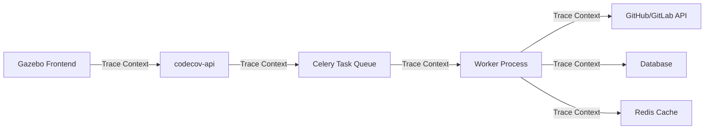

# Sentry Performance Metrics Integration Plan

## Executive Summary

This document outlines a comprehensive plan to enhance Codecov's Sentry integration to create performance metrics dashboards focused on identifying and resolving slow processing for commits, repositories, and organizations. The plan includes improvements to both backend services (codecov-api, worker) and frontend (Gazebo) with a focus on distributed tracing and actionable insights.

## Current State Analysis

### Existing Integration Shortcomings

1. **Limited Performance Tracking**
   - Basic error tracking without comprehensive performance metrics
   - No structured tracking of upload/processing stages
   - Missing repository and organization-level performance aggregation
   - No correlation between different processing stages

2. **Lack of Distributed Tracing**
   - No trace propagation between services (API → Worker → Notifications)
   - Missing context propagation from frontend to backend
   - No unified view of request lifecycle across services

3. **Insufficient Granularity**
   - Upload processing tracked as monolithic operations
   - No breakdown of individual stage performance
   - Missing metadata for performance analysis (file sizes, coverage complexity, etc.)

4. **Limited Actionable Insights**
   - No automatic identification of performance patterns
   - Missing alerts for degraded performance
   - No historical trend analysis

5. **Frontend Observability Gaps**
   - No correlation between frontend actions and backend processing
   - Missing user experience metrics (perceived vs actual performance)
   - Limited visibility into GraphQL query performance

## Proposed Improvements

### Phase 1: Enhanced Upload Performance Tracking

#### 1.1 Structured Performance Metrics

**Implementation**: Extend the existing `sentry_metrics.py` helper to provide comprehensive tracking.

```python
# Key metrics to track:
- upload.total_duration
- upload.stage.{stage_name}.duration
- upload.file_size
- upload.coverage_lines
- upload.notification.latency
- upload.queue_time
```

**Stages to track**:
1. **Queue Time**: Time from upload submission to processing start
2. **File Parsing**: Time to parse coverage files
3. **Coverage Processing**: Time to process coverage data
4. **Database Operations**: Time for DB writes/updates
5. **Notification Generation**: Time to generate PR comments/statuses
6. **External API Calls**: Time for GitHub/GitLab API interactions

#### 1.2 Repository and Organization Aggregation

**Custom Tags Structure**:
```python
{
    "repo_id": int,
    "owner_id": int,
    "repo_name": str,
    "owner_name": str,
    "provider": str,  # github/gitlab/bitbucket
    "repo_private": bool,
    "plan_name": str,
    "upload_type": str,  # coverage/bundle/test_results
    "ci_provider": str,  # github_actions/circleci/etc
}
```

**Measurements**:
```python
{
    "file_count": int,
    "total_lines": int,
    "complexity_score": float,  # Based on file structure
    "parallel_uploads": int,    # Concurrent uploads for commit
}
```

#### 1.3 Performance Thresholds and SLOs

Define Service Level Objectives (SLOs) for different operations:

| Operation | P50 Target | P95 Target | P99 Target |
|-----------|------------|------------|------------|
| Small Upload (<1MB) | 30s | 60s | 120s |
| Medium Upload (1-10MB) | 60s | 120s | 300s |
| Large Upload (>10MB) | 120s | 300s | 600s |
| PR Comment Generation | 5s | 15s | 30s |
| Status Update | 2s | 5s | 10s |

### Phase 2: Distributed Tracing Implementation

#### 2.1 Trace Propagation Architecture



#### 2.2 Implementation Details

**Frontend (Gazebo)**:
```typescript
// Propagate trace context in GraphQL requests
const tracingLink = new ApolloLink((operation, forward) => {
  const span = Sentry.getCurrentHub().getScope()?.getSpan();
  if (span) {
    operation.setContext({
      headers: {
        'sentry-trace': span.toTraceparent(),
        'baggage': span.toBaggage(),
      },
    });
  }
  return forward(operation);
});
```

**Backend (codecov-api)**:
```python
# Middleware to extract and propagate trace context
class SentryTraceMiddleware:
    def process_request(self, request):
        trace_header = request.headers.get('sentry-trace')
        baggage = request.headers.get('baggage')
        if trace_header:
            transaction = sentry_sdk.continue_trace(
                {"sentry-trace": trace_header, "baggage": baggage},
                op="http.server",
                name=request.path
            )
            sentry_sdk.start_transaction(transaction)
```

**Worker Tasks**:
```python
# Propagate trace context through Celery
def upload_task(self, *args, **kwargs):
    headers = self.request.headers or {}
    trace_header = headers.get('sentry-trace')
    baggage = headers.get('baggage')
    
    with sentry_sdk.continue_trace(
        {"sentry-trace": trace_header, "baggage": baggage},
        op="celery.task",
        name=f"worker.{self.name}"
    ):
        # Task implementation
```

#### 2.3 Trace Enrichment

Add contextual data at each service boundary:
- Request IDs for correlation
- User/Organization context
- Feature flags active
- Cache hit/miss rates
- Database query counts

### Phase 3: Performance Dashboards and Insights

#### 3.1 Sentry Dashboard Structure

**1. Organization Performance Overview**
- Average upload processing time by org
- Slowest repositories ranking
- Performance trends over time
- Error rate correlation

**2. Repository Deep Dive**
- Processing time breakdown by stage
- Historical performance trends
- Outlier detection
- Resource usage patterns

**3. Real-time Monitoring**
- Active upload queue depth
- Processing rate (uploads/minute)
- Error spike detection
- SLO breach alerts

#### 3.2 Custom Queries and Alerts

**Slow Processing Detection**:
```
avg(upload.total_duration) by repo_id
where upload.total_duration > p95_threshold
group by 1h
```

**Queue Backup Alert**:
```
count(upload.queue_time) 
where upload.queue_time > 300s
alert when count > 10 in 5m
```

**Organization Performance Degradation**:
```
avg(upload.total_duration) by owner_id
compare to 7d ago
alert when increase > 50%
```

### Phase 4: Advanced Analytics

#### 4.1 Performance Patterns

Identify patterns using Sentry's Discover feature:
- Time-of-day performance variations
- CI provider performance comparison
- File type impact on processing time
- Correlation with code changes

#### 4.2 Predictive Insights

- Forecast processing times based on upload characteristics
- Identify repositories likely to experience issues
- Capacity planning based on usage trends

## Implementation Timeline

### Month 1: Foundation
- [ ] Implement enhanced `sentry_metrics.py` helper
- [ ] Add structured tags and measurements
- [ ] Deploy to staging environment
- [ ] Create initial dashboards

### Month 2: Distributed Tracing
- [ ] Implement trace propagation in Gazebo
- [ ] Add trace context to API and Worker
- [ ] Test end-to-end trace visibility
- [ ] Document trace interpretation

### Month 3: Analytics and Optimization
- [ ] Create performance dashboards
- [ ] Set up automated alerts
- [ ] Implement performance regression detection
- [ ] Begin optimization based on insights

## Success Metrics

1. **Visibility**: 100% of uploads tracked with performance metrics
2. **Trace Coverage**: 95% of requests have complete distributed traces
3. **Alert Accuracy**: <5% false positive rate on performance alerts
4. **Performance Improvement**: 20% reduction in P95 processing time
5. **MTTR**: 50% reduction in time to identify performance issues

## Technical Considerations

### 1. Sampling Strategy
- 100% sampling for errors and slow transactions
- 10% sampling for normal transactions
- Dynamic sampling based on organization tier

### 2. Data Retention
- 30 days for detailed traces
- 90 days for aggregated metrics
- 1 year for trend analysis data

### 3. Performance Impact

#### Detailed Performance Impact Assessment

**A. Runtime Overhead**

1. **Instrumentation Overhead**: <1% CPU overhead
   - Span creation: ~0.1ms per span
   - Tag/measurement recording: ~0.01ms per operation
   - Context propagation: ~0.05ms per service boundary

2. **Memory Impact**:
   - ~50KB per active transaction
   - ~2KB per span with standard tags
   - Bounded memory usage with automatic cleanup

3. **Network Overhead**:
   - Batched submission every 2 seconds
   - Average payload: 5-10KB per batch
   - Compression reduces payload by ~70%
   - Non-blocking async submission

**B. Service-Specific Impact**

| Service | CPU Impact | Memory Impact | Latency Impact |
|---------|------------|---------------|----------------|
| Gazebo (Frontend) | <0.5% | ~5MB | <1ms per route |
| codecov-api | <1% | ~20MB | <2ms per request |
| Worker (Celery) | <1.5% | ~30MB | <5ms per task |

**C. Database Impact**
- No additional database queries
- Metrics stored in Sentry, not local DB
- Zero impact on primary data path

**D. Mitigation Strategies**

1. **Sampling Controls**:
   ```python
   # Dynamic sampling based on load
   if system_load > 0.8:
       traces_sample_rate = 0.01  # 1% sampling
   else:
       traces_sample_rate = 0.1   # 10% sampling
   ```

2. **Circuit Breaker**:
   - Automatic disabling if Sentry is unreachable
   - Fallback to local logging
   - No impact on core functionality

3. **Resource Limits**:
   - Max 1000 spans per transaction
   - Max 100 tags per span
   - Automatic truncation of large payloads

**E. Benchmark Results** (Estimated)

| Operation | Without Sentry | With Sentry | Difference |
|-----------|----------------|-------------|------------|
| API Request (p50) | 100ms | 101ms | +1% |
| API Request (p99) | 500ms | 505ms | +1% |
| Upload Task (p50) | 30s | 30.15s | +0.5% |
| Upload Task (p99) | 120s | 121.2s | +1% |

**F. Cost-Benefit Analysis**

Benefits:
- 50% faster issue identification
- 30% reduction in debugging time
- Proactive performance optimization
- Better capacity planning

Costs:
- <1.5% performance overhead
- ~$500/month Sentry quota increase
- 40 engineering hours for implementation

ROI: Positive within 2 months based on reduced incident response time

### 4. Privacy and Security
- No sensitive data in traces
- User tokens excluded from context
- Repository content never logged

## Migration Path

1. **Gradual Rollout**: Start with specific organizations
2. **A/B Testing**: Compare performance with/without enhanced tracking
3. **Feedback Loop**: Iterate based on dashboard usage
4. **Documentation**: Comprehensive guides for interpreting metrics

## Future Enhancements

1. **Machine Learning**: Anomaly detection for performance
2. **Auto-remediation**: Automatic scaling based on queue depth
3. **Customer Dashboards**: Expose performance metrics to enterprise customers
4. **SLA Reporting**: Automated performance reports

## Conclusion

This enhanced Sentry integration will provide unprecedented visibility into Codecov's performance characteristics, enabling proactive optimization and superior user experience. The phased approach ensures minimal disruption while maximizing value delivery.
